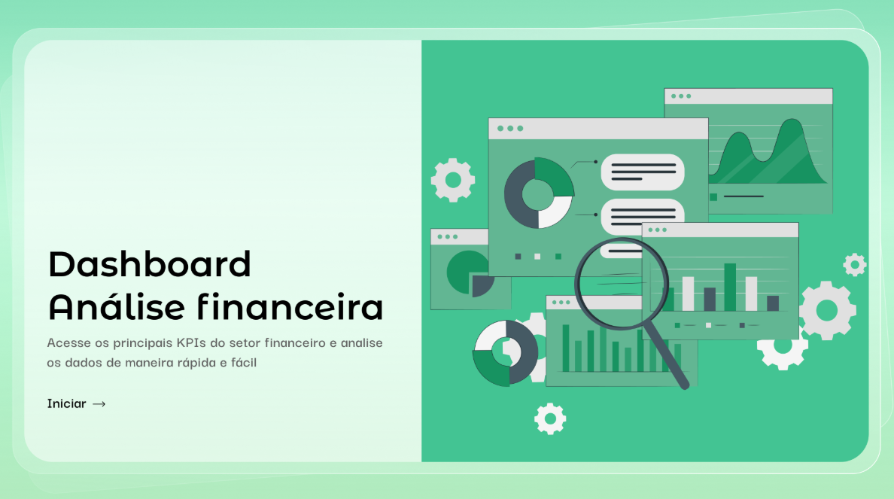

# 💰 Dashboard de Gestão Financeira

Projeto desenvolvido durante a Aula 01 da Imersão de Power BI para Negócios. O objetivo foi transformar dados brutos de movimentações financeiras em uma ferramenta de controle de fluxo de caixa e análise de despesas.

## 🛠️ Tecnologias e Ferramentas
* **Power BI** (Desktop)
* **Power Query** (Processamento e ETL)
* **Linguagem DAX** (Criação de métricas)

## 📊 Funcionalidades Técnicas
* **ETL (Extração e Limpeza):** Tratamento de base Excel com normalização de tipos de dados (datas e valores monetários).
* **Análise de Categorias:** Segmentação por Natureza da Conta (Receitas vs. Despesas) e Classificação (Fixo vs. Variável).
* **Navegação:** Implementação de Menu Home para melhor experiência do usuário (UX).

## 📈 Insights Gerados
* Identificação rápida da saúde financeira mensal.
* Visualização da representatividade de despesas operacionais sobre o faturamento.

## 📷 Visualização do Projeto

