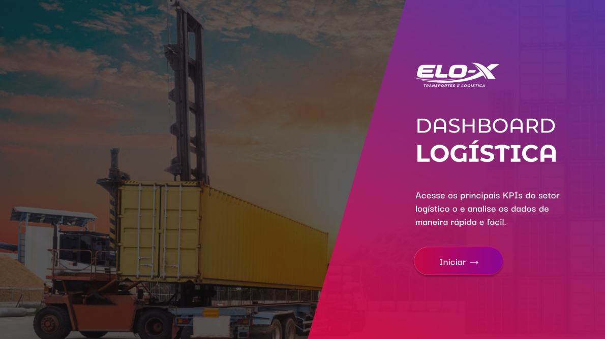
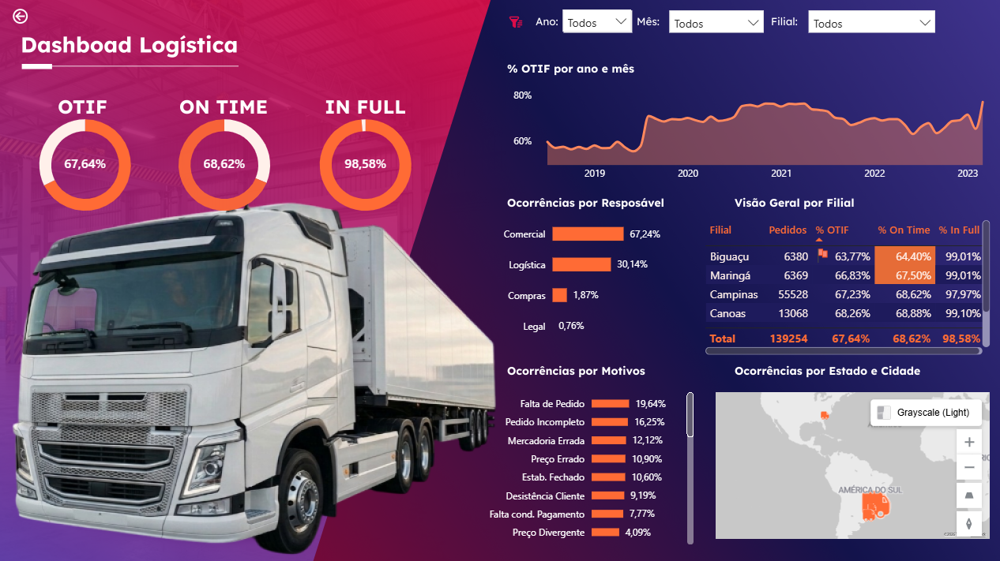

# 🚚 Dashboard de Performance Logística

Análise focada em eficiência operacional, monitoramento de prazos de entrega (Lead Time) e gestão de frota. Desenvolvido na Aula 02 da Imersão de Power BI.

## 🛠️ Processos de Dados
* **Tratamento de Strings:** Separação da coluna de Destino (Região/Estado/Cidade) para análise geográfica.
* **Cálculos de Tempo:** Criação de medidas para monitorar atrasos e eficiência de entrega.

## 📊 Principais Indicadores (KPIs)
* **Ocorrências de Devolução:** Análise por motivo e responsabilidade (Filial/Transportadora).
* **Segmentação de Frota:** Desempenho por tipo de veículo (Truck, Carreta, Toco) e carroceria.
* **Visão Geográfica:** Distribuição de entregas por filiais (Maringá, Niterói, Campinas e Contagem).

## 🚀 Diferenciais do Projeto
* Design focado em "Centro de Comando" para tomadas de decisão rápidas em logística.

## 📸 Visualização do Projeto

