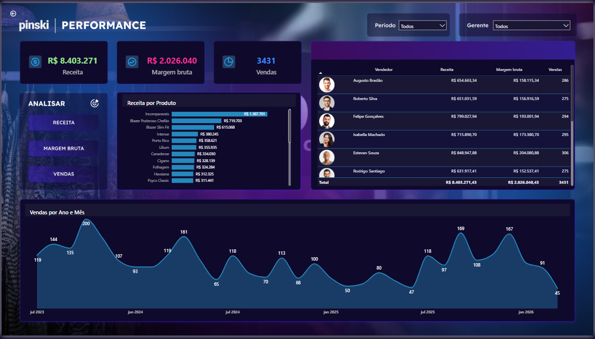
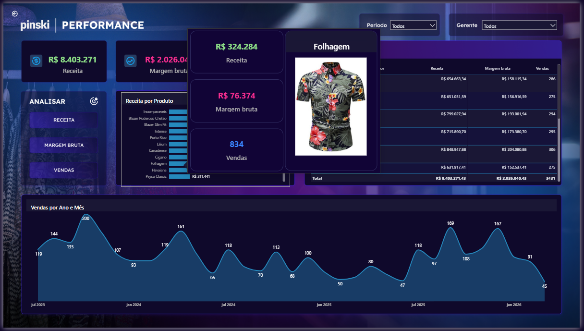

# 📈 Dashboard Comercial e Performance de Vendas

Projeto final da imersão, focado em modelagem de dados avançada e análise de rentabilidade de produtos.

## 🛠️ Modelagem de Dados
* **Esquema Estrela (Star Schema):** Integração de múltiplas tabelas (Fatos: Registro de Vendas; Dimensões: Cadastro de Produtos e Vendedores).
* **DAX Avançado:** Cálculos de Receita Líquida, Margem de Lucro e Performance de Metas.

## 📊 Recursos de Visualização
* **Tooltips (Dicas de Ferramenta):** Gráficos flutuantes que detalham a performance do produto ao passar o mouse.
* **Hierarquia de Gerenciamento:** Filtros dinâmicos por Gerente e Vendedor.
* **Análise de Portfólio:** Visão detalhada por categoria de produto (ex: Camisas Floridas) e tamanhos.

## 📂 Como visualizar
1. Baixe o arquivo `Dashboard-Vendas/Aula 3 - Dashboard Vendas - Xperiun.pbix` deste repositório.
2. Abra no Power BI Desktop.

## 📸 Visualização do Projeto

